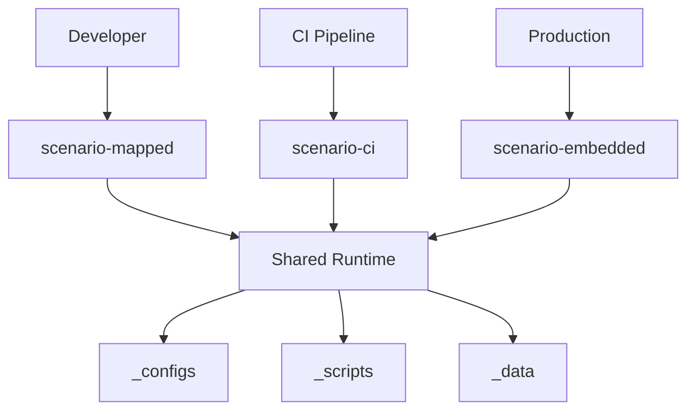

# multi-scenario-docker-pattern

This repository is a working reference implementation of the Multi-Scenario Docker Pattern described below.

It contains a minimal Symfony application with two ready-to-use deployment scenarios — `scenario-mapped` for local development and `scenario-embeded` for server deployment — built on a single shared Docker runtime.

## Quick start

```bash
# Clone and create environment files from examples
git clone <repo-url>
cd multi-scenario-docker-pattern
cp .env.example .env

# Local development (VS Code Dev Containers or Makefile)
cp .devcontainer/scenario-mapped/.env.example .devcontainer/scenario-mapped/.env
cd .devcontainer/scenario-mapped
make up
make install

# Server deployment
cp .devcontainer/scenario-embeded/.env.example .devcontainer/scenario-embeded/.env
cd .devcontainer/scenario-embeded
make deploy
```

App: `http://localhost:8080` · Database: `localhost:5432`

---

# The Multi-Scenario Docker Pattern: how to build a reproducible Docker environment for any conditions

## The Problem: Docker does not guarantee consistency on its own

A common misconception is that using Docker automatically solves the problem of environment consistency. In practice, things work differently. Even at the `FROM` level you can get different results if you don't pin the platform or image version. From there, divergence only accumulates.

The typical evolution of a project looks like this:

* first there is one Dockerfile that simply builds the application;
* then a second one appears — for the test environment;
* then a third — because production has a different PHP or runtime configuration;
* then someone "temporarily" adds xdebug or hardcodes a database path;
* eventually nobody knows for sure which Dockerfile is the "correct" one.

The result is a single repository containing several nearly identical environments that drift apart gradually and silently. The problem is not Docker. The problem is that the project structure allows environment drift.

---

## The Principle: one runtime, many scenarios

This pattern is built on a simple idea:

> one runtime + multiple deployment scenarios

The Dockerfile and the base environment must be singular. Differences are only allowed at the scenario level. When all scenarios share one runtime and one set of common configurations, divergence between environments becomes explicit rather than accidental.

A scenario is not just a compose file. It is a self-contained unit for launching an environment, consisting of:

* `docker-compose.yml`
* `.env`
* `Makefile`
* `devcontainer.json`
* additional scripts

---

## Project Structure

```text
my-app/
├── .devcontainer/
│   ├── _configs/              # shared runtime configurations
│   ├── _scripts/              # shared entrypoint scripts
│   ├── _data/                 # auxiliary binary dependencies
│   ├── scenario-mapped/       # local development (bind mount)
│   │   ├── docker-compose.yml
│   │   ├── devcontainer.json
│   │   ├── Makefile
│   │   └── .env
│   ├── scenario-embedded/     # deploy image (code inside the image)
│   │   ├── docker-compose.yml
│   │   ├── devcontainer.json
│   │   ├── Makefile
│   │   └── .env
│   ├── Dockerfile.app
│   ├── Dockerfile.database
│   └── Dockerfile.*
├── .env                       # base application configuration
└── ...
```

---

## Execution Flow



Different scenarios share the same runtime and the same set of common resources. Scenarios do not create different systems — they only switch the way the same system is launched.

---

## How It Works

### One base runtime

All scenarios use the same set of Dockerfiles. For example, `Dockerfile.app` might contain:

* PHP runtime;
* extensions;
* Composer;
* system dependencies;
* base web server configuration.

This layer does not depend on any scenario.

---

### Scenarios differ only in how they launch

Scenarios define: how code gets into the container, which environment variables are used, which tools are enabled.

#### scenario-mapped

Local development: code is mounted via bind mount, changes are reflected instantly, fast dev cycle, convenient for debugging.

#### scenario-embedded

Production / CI: code is copied inside the image, the container does not depend on the host, the environment is reproducible anywhere.

---

## Why This Matters

The key idea of the pattern:

> consistency is achieved not by team discipline, but by project structure

All scenarios use one runtime and one set of configurations from `_configs`. This means that differences become explicit, runtime versions do not drift silently, and changes are automatically applied to all scenarios.

Note: this does not make drift impossible, but it makes it visible and controllable.

---

## Why Not Docker Compose Profiles

Docker Compose Profiles allow enabling and disabling services within a single compose file. For simple cases this is enough. However, profiles solve only one problem — managing the set of services.

In this approach, a scenario is a broader concept. It includes not just a compose file, but also:

* `.env`;
* `Makefile`;
* `devcontainer.json`;
* additional scripts;
* environment launch rules.

A scenario is a complete environment, not just a service toggle.

---

## Why Separate Scenario Directories

The typical path of project evolution often looks like this:

```text
docker-compose.yml
	↓
docker-compose.dev.yml
	↓
docker-compose.prod.yml
	↓
docker-compose.staging.yml
```

Over time this becomes a system of overrides:

```bash
docker compose \
  -f docker-compose.yml \
  -f docker-compose.override.yml \
  -f docker-compose.staging.yml \
  up
```

Understanding what will actually end up in the final configuration becomes increasingly difficult. In the scenario approach, launching looks like this:

```bash
cd .devcontainer/scenario-mapped
make up
```

or

```bash
cd .devcontainer/scenario-embedded
make deploy
```

A scenario becomes a physical object in the repository, not a combination of flags and files.

---

## CI Is Just Another Scenario

An interesting side effect of this approach is that CI stops being a separate world. Instead of special logic inside GitHub Actions or GitLab CI, the pipeline can use the same scenario as the rest of the environments. Local development, CI, and production start using the same launch model. The fewer differences between these environments, the less likely you are to get surprises after deployment.

---

## Podman Support

The pattern is not tied to Docker Engine. Since scenarios describe the way of launching rather than a specific container engine, the same set of scenarios can be used with both Docker and Podman through a compatible interface. Differences remain at the level of the launch environment, not the project architecture.

---

## What the Pattern Guarantees

The pattern provides:

* a single runtime for all scenarios;
* no hidden differences between dev and prod;
* explicit separation of launch scenarios;
* isolation of dev tools from production;
* centralized configuration through a shared layer.

---

## Limitations

The pattern does not eliminate the need for architectural discipline. It is still important to:

* not add scenario-specific logic to the shared runtime;
* not duplicate configurations outside `_configs`;
* not mix dev and production behavior inside a Dockerfile.

---

## Summary

Most problems in Docker projects do not appear because of containers — they appear because of multiple nearly identical ways of launching the same application. The Multi-Scenario Docker Pattern addresses exactly this problem: instead of several gradually diverging environments, you get one runtime and several explicit scenarios for using it.

> DON'T CHANGE THE ENVIRONMENT — CHANGE THE SCENARIO
